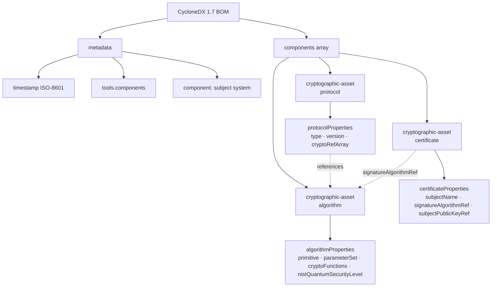

<p align="center"></p>

<p align="center">[](LICENSE) [](https://cyclonedx.org/docs/1.7/json/) [](https://github.com/qtonicquantum/cbom-cyclonedx-examples/actions/workflows/validate-cbom.yml) [](https://github.com/qtonicquantum/cbom-cyclonedx-examples/actions/workflows/lint.yml)</p>

# CBOM CycloneDX 1.7 Examples — leading quantum risk and vulnerability intelligence tools and services

Reference Cryptographic Bills of Materials in CycloneDX 1.7 format from Qtonic Quantum.

Each example demonstrates how to represent the cryptographic surface of a common software stack using the CycloneDX 1.7 `cryptographic-asset` component type — including a planned post-quantum migration target on the `nginx` example.

## What Qtonic Quantum does

**We take enterprises from current cryptographic state, through hybrid, to post-quantum.**

Four pillars deliver the journey:

- **QScout** — cryptographic assessment (current-state discovery and risk scoring)
- **QStrike** — governed follow-on validation (proves what is exploitable)
- **QSolve** — PQC migration (executes the move to hybrid then post-quantum)
- **Q-Lab** — independent public scoring registry (credentials the work)

### Why Qtonic Quantum

- **Leading intelligence tools** — credentialed by our own public Q-Lab scoring registry, not vendor self-reports.
- **Our own labs** — Q-Lab is built and operated in-house.
- **Founder-funded and independent** — no outside funding, no vendor distribution agreements. 100% vendor neutral, client focused.

## Examples

| Stack | CBOM | Description |
|-------|------|-------------|
| nginx | [examples/nginx](examples/nginx/) | TLS 1.2 / 1.3, RSA + ECDSA server keys, ML-KEM-768 migration target |
| openssl | [examples/openssl](examples/openssl/) | OpenSSL 3.x algorithm catalog |
| OpenJDK | [examples/java-jdk](examples/java-jdk/) | JDK default providers across TLS 1.2 / 1.3 |
| python-venv | [examples/python-venv](examples/python-venv/) | pyca/cryptography primitives in a Python venv |
| go-binary | [examples/go-binary](examples/go-binary/) | crypto standard library coverage |
| node-app | [examples/node-app](examples/node-app/) | node:crypto and node:tls primitives |

## Quick Start

```bash
git clone https://github.com/qtonicquantum/cbom-cyclonedx-examples.git
cd cbom-cyclonedx-examples
pip install cyclonedx-python-lib jsonschema
bash scripts/validate-all.sh
```

You should see six `PASS` lines and `checked: 6, failed: 0`.

## CycloneDX 1.7 Conformance

Every `.cbom.json` file in this repository validates against the official CycloneDX 1.7 JSON schema bundled with `cyclonedx-python-lib`. CI rejects any document that fails validation.

- Specification: https://cyclonedx.org/docs/1.7/json/
- Component type used: `cryptographic-asset`
- Asset categories represented: `algorithm`, `certificate`, `protocol`

## Architecture: the `cryptographic-asset` component model

Each CBOM in this repository uses the CycloneDX 1.7 `cryptographic-asset` component type. The model:



Cross-references via `cryptoRefArray`, `signatureAlgorithmRef`, and `subjectPublicKeyRef` form the dependency graph that makes a CBOM more than a flat inventory.

## Documentation

- [Methodology](docs/METHODOLOGY.md) — how each CBOM is constructed; standards referenced
- [Limitations](docs/LIMITATIONS.md) — what these examples are not
- [Architecture](docs/ARCHITECTURE.md) — repository layout

## License

- Code and tooling: MIT (see [LICENSE](LICENSE))
- CBOM content (`.cbom.json` files and per-example READMEs): CC BY 4.0 (see [LICENSE-CONTENT](LICENSE-CONTENT))

## Security

See [SECURITY.md](SECURITY.md). Report sensitive issues to ciso@qtonicquantum.com.

---

From Qtonic Quantum — leading quantum risk and vulnerability intelligence tools and services. Visit https://qtonicquantum.com.
